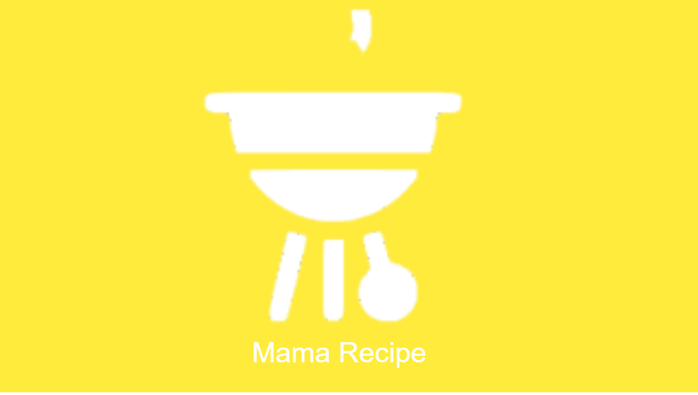

<div id="top"></div>

<!-- HEADER -->
<div align="center">
  <a href="https://github.com/rifqiay/Angkasa-Ticketing-Frontend">
    
  </a>
  
  <h3 align="center">Recipe-App-Frontend with React.js</h3>
</div>

<!-- TABLE OF CONTENTS -->

## Table of Contents

<details>
  <summary>Table of Contents</summary>
  <ol>
    <li>
       <a href="#about-the-project">About The Project</a>
      <ul>
        <li><a href="#built-with">Built With</a></li>
      </ul>
    </li>
    <li>
       <a href="#getting-started">Getting Started</a>
      <ul>
        <li><a href="#prerequisites">Prerequisites</a></li>
        <li><a href="#installation">Installation</a></li>
      </ul>
    </li>
    <li><a href="#related-project">Related Project</a></li>
    <li><a href="#screenshoots">Screenshot</a></li>
    <li><a href="#contributing">Contributing</a></li>
    <li><a href="#our-team">Our Team</a></li>
  </ol>
</details>

<!-- ABOUT THE PROJECT -->

## About The Project

Angkasa Ticketing is an online ticket booking application. This application is intended for users who want to travel both nationally and internationally, using airplanes.

### Built With

This application was developed using a framework/library

- [React Js](https://reactjs.org/)
- [Javascript](https://www.javascript.com/)
- [Axios](https://axios-http.com/)
- [Redux](https://redux.js.org/)
- [Bootstap](https://getbootstrap.com)
<p align="right">(<a href="#top">back to top</a>)</p>

<!-- GETTING STARTED -->

## Getting Started

### Prerequisites

Make sure that Node JS is installed on the computer.

- [Node.Js](https://nodejs.org/en/download/)

### Installation

1. Get a free API Key at [https://github.com/20000710/Recipe-App-Backend.git](https://github.com/rifqiay/Angkasa-Ticketing-Backend)
2. Clone this repo (Recipe-App-Frontend)
   ```sh
   git clone https://github.com/20000710/Recipe-App-Frontend.git
   ```
3. Go To Folder Repo
   ```sh
   cd Recipe-App-Frontend
   ```
4. Install NPM packages
   ```sh
   npm install
   ```
5. Enter your API in `.env`
   ```js
   REACT_API_BACKEND = "ENTER YOUR API";
   ```
6. Start website
`sh npm start `
<p align="right">(<a href="#top">back to top</a>)</p>

<!-- Related Project -->

## Related Project

:rocket: [`Recipe-App-Backend`](https://github.com/20000710/Recipe-App-Backend.git)

<p align="right">(<a href="#top">back to top</a>)</p>

<!-- Screenshoots -->

## Screenshoots

<p align="center" display=flex>
<table>
  <tr>
    <td><image src="./screenshot/register page.png" alt="Register Page" width=100%></td>
    <td><image src="./screenshot/login page.png" alt="Login Page" width=100%/></td>
  </tr>
   <tr>
    <td>Register</td>
    <td>Login</td>
  </tr>
  
  <tr>
    <td><image src="./screenshot/landing page.png" alt="Home Page" width=100% ></td>
    <td><image src="./screenshot/search page.png" alt="Search Flight from Home" width=100%/></td>
  </tr>
  <tr>
    <td>Home</td>
    <td>Search</td>
  </tr>
  <tr>
    <td><image src="./screenshot/add recipe page.png" alt="Search Flight" width=100%/></td>
    <td><image src="./screenshot/resep detail.png" alt="Flight detail" width=100%></td>
  </tr>
  <tr>
     <td>Add Receipe</td>
     <td>Receipe Detail</td>
  </tr>
  
  <tr>
    <td><image src="./screenshot/video page.png" alt="My booking flight" width=100%></td>
    <td><image src="./screenshot/profile page.png" alt="Profile" width=100%></td>
  </tr>
  <tr>
    <td>Video</td>
    <td>Profile</td>
  </tr>
</table>

<p align="right">(<a href="#top">back to top</a>)</p>

<!-- CONTRIBUTING -->

## Contributing

Contributions are what make the open source community such an amazing place to learn, inspire, and create. Any contributions you make are **greatly appreciated**.
If you have a suggestion that would make this better, please fork the repo and create a pull request. You can also simply open an issue with the tag "enhancement".
Don't forget to give the project a star! Thanks again!

1. Fork the Project
2. Create your Feature Branch `git checkout -b feature/food-receipe`
3. Commit your Changes `git commit -m 'Add some food-receipe-feature'`
4. Push to the Branch `git push origin feature/food-receipe`
5. Open a Pull Request
<p align="right">(<a href="#top">back to top</a>)</p>

## Our Team

<center>
  <table>
    <tr>
      <th>Frontend/PM</th>
      <th>Frontend</th>
      <th>Frontend</th>
      <th>Backend</th>
      <th>Backend</th>
    </tr>
    <tr>
      <td align="center">
        <a href="https://github.com/20000710">
          <br/>
          <b>Zaki Khairi Ziwar</b>
        </a>
      </td>
      <td align="center">
        <a href="https://github.com/mallyaagung">
          <br/>
          <b>Muhamad Allya Agung Syafira</b>
        </a>
      </td>
      <td align="center">
        <a href="https://github.com/rifqiay">
          <br/>
          <b>Muhammad Rifqi Ainul Yaqin</b>
        </a>
      </td>
      <td align="center">
        <a href="https://github.com/janexmgd">
          <br/>
          <b>Denny Wahyu Prasetyo</b>
        </a>
      </td>
      <td align="center">
        <a href="https://github.com/Hnaa17">
          <br/>
          <b>Farhana Achmad </b>
        </a>
      </td>
    </tr>
  </table>
</center>
<p align="right">(<a href="#top">back to top</a>)</p>
